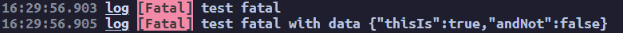
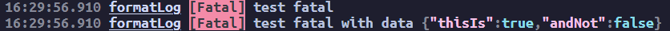
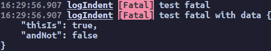

# Logmatic

Welcome to logmatic.

A simple, lightweight and customisable logger for all your needs.

# Usage

To install, run:
`npm i logmatic --save-exact`
This saves the script as its exact version and does not break your platform if it updates to breaking changes.
This is added solely due to the program being in a unstable state and being developed as we work along.

## Files

Logmatic supports both ES6 and commonjs formatting and is used in the following way, for configuring, see [#Config](#config)

```javascript
const { logger } = require('../dist/commonjs/index.cjs'); // Commonjs
import { logger } from '../dist/es6/index.mjs'; // ES6

//Then initialise the logger with your settings:
const log = new logger('test', { logLevel: 0 });
// In this case, we initialise our logger to not block any levels. See #config

// Then we can call the logger to log:
log.trace("Your Logging Information", { anyData: "that you want logged!" });
log.debug("Your Logging Information", { anyData: "that you want logged!" });
log.info("Your Logging Information", { anyData: "that you want logged!" });
log.warn("Your Logging Information", { anyData: "that you want logged!" });
log.error("Your Logging Information", { anyData: "that you want logged!" });
log.fatal("Your Logging Information", { anyData: "that you want logged!" });
```

## Config

The Config has many options. For the following segment, these words have the following definitions

```javascript
new logger(/*!Name!*/, /*!Config!*/, /*!Files Config!*/);
```
(For powerusers, see the types [here](https://github.com/TinnyTerr/logmatic/blob/main/src/types.ts#L29) and [here](https://github.com/TinnyTerr/logmatic/blob/main/src/types.ts#L13) and files [here](https://github.com/TinnyTerr/logmatic/blob/main/src/types.ts#L46))


Name            - Name is the only required argument

Config          - The config of how it logs. See [#Logging Config](#logging-config):
- [#Log level](#logging-config---log-level)
- [#Supress Warnings](#logging-config---supress-warnings)
- [#Formatting](#logging-config---formatting)
- [#Indentation](#logging-config---indentation)

Files Config    - The config of how it writes the log to files. See [#Files Config](#files-config):
- [#Enabled](#files-config---enabled), [#No Console](#files-config---no-console)
- [#Path](#files-config---path)
- [#Type](#files-config---type)
- [#Naming](#files-config---naming)

For the config sections, the examples will have the following config:
```javascript
const log = new Logger("log", { logLevel: 5 }); // + the config being demonstated
```
The logs are taken from the [CommonJS test file](./tests/test.cjs).

### Logging Config

#### Logging Config - Log level

```typescript
type logLevel = Level | undefined;
```

Log level is the level that is emitted. Shown in the enum:

```typescript
enum Level {
    Trace = 0,
    Debug = 1,
    Info = 2,
    Warn = 3,
    Error = 4,
    Fatal = 5,
    Internal = 6,
    None = 7,
}
```

Select the level you wish output or None. Eg, to only log fatal and above, you set the loglevel to 5 or import it and use it as a object and the following is output:


---

#### Logging Config - Supress Warnings

```typescript
type suppressLoggerWarning = boolean | undefined;
```

Suppresses warnings output by the logger. Any error thrown while outputting is passed through to the original script.
Current errors supressed are: 
- ANSI colouring text in log name.

**No example**

---

#### Logging Config - Formatting

```typescript
type format = boolean | undefined;
```

Formatting the objects/arrays passed to the class.
Calls JSON.stringify or colourize using the object using the indentation provided and outputs it (See [#Indentation](#logging-config---indentation))



---

#### Logging Config - Indentation

```typescript
type indent = number | boolean | undefined;
// Converted to
type indent = number | undefined;
// Within the constructor
```
Indents objects/arrays passed to the class
Calls JSON.stringify and passes object and indentation and outputs it.



### Files Config

**WARNING:** Files is currently experimental and should not be relied upon in this build.

#### Files Config - Enabled

```typescript
type enabled = boolean | undefined;
```

If logging to file is enabled. If enabled is false, every other option is completely ignored and the package runs as normal

---

#### Files Config - No Console

```typescript
type noConsole = boolean | null | undefined;
```

If this is true, stdout remains empty and does not output anything. This is ignored if the file it tries to log to failes to open and [#Suppress Warnings](#logging-config---supress-warnings) is true, else it errors out.

---

#### Files Config - Path

```typescript
type path = string | null | undefined;
```

Path is a string to a file, relative to the initial files root OR an absolute path provided (`../log/` OR `/workspaces/repo/log/`)

---

#### Files Config - Naming

```typescript
type naming = string | null | undefined;
```

Naming is the scheme the filenames will follow. In the event that a file already exists, either an error is thrown or the file is deleted then written to again (See [#Suppress Warnings](#logging-config---supress-warnings))

---

#### Files Config - Type

```typescript
type type = "json" | "txt" | "log" | null | undefined;
```

Type is the type of file that is written. txt and log files are written the same and json files are written as an array of type:

```typescript
interface FileFormat {
    level: `${number}`; // See #LogLevel for level enum
    date: `${string}`; // See getTime() in src/index.ts
    data: `${string}`; // Stringified JSON or string/numbers
}

type File = FileFormat[]
```

# Contributing

For contributing to this project, feel free to fork and pr. For breaking changes, submit an issue beforehand to set out the path and planning.
